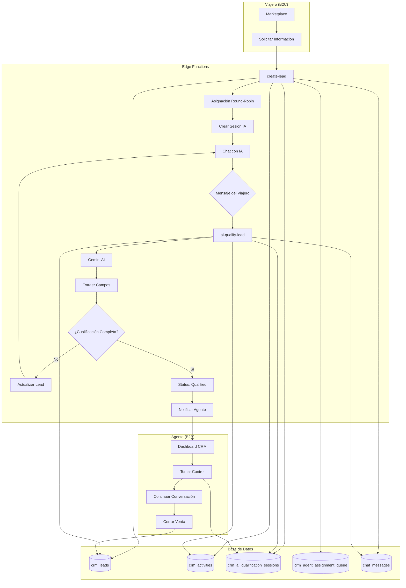

# CRM Integrado con IA de Cualificación Progresiva

## Tabla de Contenidos

1. [Resumen Ejecutivo](#1-resumen-ejecutivo)
2. [Arquitectura General](#2-arquitectura-general)
3. [Flujo Completo del CRM](#3-flujo-completo-del-crm)
4. [Estructura de Base de Datos](#4-estructura-de-base-de-datos)
5. [Edge Functions (APIs)](#5-edge-functions-apis)
6. [Frontend](#6-frontend)
7. [Ejemplos de Uso](#7-ejemplos-de-uso)
8. [Configuración y Despliegue](#8-configuración-y-despliegue)

---

## 1. Resumen Ejecutivo

### ¿Qué es el CRM Integrado?

El CRM integrado es un sistema de gestión de relaciones con clientes embebido directamente en la plataforma LPAV Marketplace. A diferencia de un CRM tradicional, este sistema automatiza la cualificación de leads mediante inteligencia artificial, permitiendo que los agentes de viajes se enfoquen en cerrar ventas en lugar de realizar tareas administrativas repetitivas.

### Propósito

Automatizar el proceso de cualificación de leads mediante IA conversacional, reduciendo el tiempo de respuesta inicial y asegurando que cada lead llegue al agente humano con la información esencial ya recopilada.

> **Disponibilidad por Plan:** La funcionalidad de pre-calificación automatizada con IA está disponible para los planes **Intermedio, Premium y Fundador**. El **Plan Básico** no cuenta con agente de IA; en su lugar, los leads se reciben mediante formularios tradicionales y se asignan manualmente a los agentes. El resto de las funcionalidades del CRM (bandeja de leads, pipeline de estados, actividades, notas, filtros) están disponibles para todos los planes sin distinción.

### Beneficios Clave

- **Reducción del tiempo de respuesta**: La IA responde inmediatamente cuando un viajero solicita información, sin importar la hora del día.
- **Cualificación automática**: Extrae progresivamente información crítica (presupuesto, fechas, número de viajeros) sin que el viajero sienta que está siendo interrogado.
- **Integración nativa**: El CRM vive dentro del marketplace, eliminando la necesidad de saltar entre múltiples herramientas.
- **Escalabilidad multi-tenant**: Cada agencia tiene su propio espacio aislado con leads, agentes y métricas independientes.
- **Asignación inteligente**: Distribución automática de leads entre agentes mediante algoritmo round-robin.
- **Transparencia completa**: Los agentes ven todo el historial de conversación entre la IA y el viajero.

### Stack Tecnológico

- **Base de datos**: Supabase (PostgreSQL) con Row-Level Security
- **Inteligencia Artificial**: Google Gemini 2.5 Flash con structured outputs
- **Frontend**: React 19 + TypeScript + Tailwind CSS
- **Realtime**: Supabase Realtime para actualizaciones en tiempo real
- **Edge Functions**: Deno para APIs serverless
- **Chat**: WebSocket nativo de Supabase

---

## 2. Arquitectura General

### Diagrama de Arquitectura



### Componentes Principales

#### 1. Base de Datos (4 tablas)

- **`crm_leads`**: Almacena información del lead, estado del pipeline, campos extraídos por IA
- **`crm_activities`**: Timeline de actividades (notas, cambios de estado, extracciones de IA)
- **`crm_ai_qualification_sessions`**: Rastrea el progreso de cualificación de cada lead
- **`crm_agent_assignment_queue`**: Cola round-robin para asignación automática de agentes

#### 2. Edge Functions (6 APIs)

- **`create-lead`**: Crea lead, asigna agente, inicia sesión IA
- **`ai-qualify-lead`**: Procesa mensaje del viajero, extrae información con Gemini
- **`assign-lead`**: Reasigna lead manualmente
- **`update-lead-status`**: Cambia estado del lead en el pipeline
- **`add-lead-activity`**: Agrega nota o actividad al lead
- **`transfer-lead-to-human`**: Transfiere conversación de IA a agente humano

#### 3. Frontend (5 componentes)

- **`AgencyCRM.tsx`**: Vista principal con lista de leads y filtros
- **`LeadCard.tsx`**: Tarjeta de lead con progreso de cualificación
- **`LeadDetailModal.tsx`**: Detalle completo del lead con timeline
- **`LeadFilters.tsx`**: Filtros por estado y prioridad
- **`AIQualificationProgress.tsx`**: Barra de progreso visual

#### 4. Integración con IA

- **Modelo**: Google Gemini 2.5 Flash
- **Structured Output**: JSON schema para extracción confiable de campos
- **Prompt System**: Diseñado para conversación natural, no interrogatorio
- **Iterativo**: Extrae información progresivamente a lo largo de múltiples mensajes

### Flujo de Datos

1. **Creación**: Viajero solicita información → `create-lead` → lead creado con status "new"
2. **Asignación**: Round-robin asigna agente automáticamente
3. **Cualificación**: Chat con IA extrae información progresivamente
4. **Actualización**: Cada mensaje actualiza `crm_leads.ai_qualification_progress`
5. **Completitud**: Cuando `estimated_budget` se obtiene, status cambia a "qualified"
6. **Transferencia**: Agente toma control manualmente o IA transfiere automáticamente
7. **Gestión**: Agente gestiona lead hasta cierre (won/lost)

---

## 3. Flujo Completo del CRM

### 3.1 Creación de Lead

**Trigger**: Viajero hace clic en "Solicitar información" en un paquete publicado.

**Proceso Automático**:

1. **Validación del paquete**
   - Verificar que el paquete existe y está publicado
   - Obtener `tenant_id` de la agencia propietaria

2. **Creación del lead**
   ```sql
   INSERT INTO crm_leads (
     tenant_id, 
     traveler_user_id, 
     package_id, 
     estimated_budget, 
     source, 
     status, 
     conversation_id
   ) VALUES (...)
   ```

3. **Creación de conversación de chat**
   - Generar `conversation_id` único
   - Vincular lead con conversación

4. **Asignación de agente (round-robin)**
   - Obtener lista de agentes del tenant
   - Seleccionar siguiente agente en la cola
   - Actualizar `crm_agent_assignment_queue`
   - Asignar `assigned_to` en el lead

5. **Creación de sesión de cualificación IA**
   ```sql
   INSERT INTO crm_ai_qualification_sessions (
     lead_id, 
     conversation_id, 
     fields_pending, 
     status
   ) VALUES (...)
   ```

6. **Envío de notificación al agente**
   - Notificación push en la plataforma
   - Metadata: `lead_id`, `package_id`

7. **Mensaje de bienvenida**
   - IA envía mensaje inicial al viajero
   - Mensaje personalizado con nombre del viajero y título del paquete

**Código de referencia**: `supabase/functions/create-lead/index.ts`

### 3.2 Cualificación por IA

**Prompt del Sistema**:

```
Eres un asesor de viajes amable y profesional de {agency_name}. 
El viajero está interesado en el paquete: "{package_title}" ({region}, desde {price} {currency}).

Tu objetivo es conversar naturalmente con el viajero, resolver sus dudas sobre el paquete y, 
de forma orgánica, obtener la siguiente información:

OBLIGATORIO:
- Presupuesto estimado (puede ser monto exacto o rango, ej: "15000" o "15000-25000")

OPCIONAL (pregunta de forma natural, no como interrogatorio):
- Número de viajeros
- Fechas preferidas de viaje
- Tipo de viaje (Playa, Aventura, Cultural, Familiar, Lujo, Mochilero)
- Ciudad/país de origen
- Aerolínea preferida
- Tipo de alojamiento (Hotel, Hostel, Airbnb, Resort, All-Inclusive)
- Requerimientos especiales

INFORMACIÓN YA OBTENIDA: {extracted_so_far}

REGLAS:
- NUNCA reveles que eres una IA. Actúa como un agente humano.
- No hagas más de 2 preguntas por mensaje.
- Si el viajero pide hablar con un humano, establece should_transfer_to_human en true.
- Si el viajero se niega a dar información, no insistas y establece should_transfer_to_human en true.
- Sé conciso, amable y natural.
- Responde siempre en español.
- Si ya tienes el presupuesto (obligatorio), puedes mencionar que un agente humano se comunicará pronto con una propuesta personalizada.
```

**Campos Extraídos**:

**Obligatorio**:
- `estimated_budget`: Presupuesto estimado (monto exacto o rango)

**Opcionales**:
- `number_of_travelers`: Número de viajeros
- `preferred_travel_dates`: Fechas preferidas
- `travel_type`: Tipo de viaje (Playa, Aventura, Cultural, etc.)
- `traveler_origin`: Ciudad/país de origen
- `preferred_airline`: Aerolínea preferida
- `accommodation_type`: Tipo de alojamiento
- `special_requirements`: Requerimientos especiales

**Proceso Iterativo**:

1. Viajero envía mensaje
2. Frontend detecta lead activo y llama a `ai-qualify-lead`
3. Edge Function:
   - Obtiene historial del chat (últimos 30 mensajes)
   - Construye prompt con contexto del paquete y agencia
   - Llama a Gemini 2.5 Flash con structured output
   - Parsea respuesta JSON
   - Actualiza `crm_leads.ai_qualification_progress`
   - Actualiza `crm_ai_qualification_sessions.fields_extracted`
   - Inserta respuesta de IA en `chat_messages`
   - Si cualificación completada, cambia status a "qualified"
   - Si viajero pide humano, marca sesión como "abandoned"

**Criterios de Completitud**:

- **Completado**: Cuando `estimated_budget` está presente
- **Status cambia**: `new` → `contacted` → `qualified`
- **Notificación**: Agente recibe notificación push

**Structured Output Schema**:

```json
{
  "type": "object",
  "properties": {
    "reply": { "type": "string" },
    "extracted_fields": {
      "type": "object",
      "properties": {
        "number_of_travelers": { "type": ["number", "null"] },
        "preferred_travel_dates": { "type": ["string", "null"] },
        "estimated_budget": { "type": ["string", "null"] },
        "travel_type": { "type": ["string", "null"] },
        "traveler_origin": { "type": ["string", "null"] },
        "preferred_airline": { "type": ["string", "null"] },
        "accommodation_type": { "type": ["string", "null"] },
        "special_requirements": { "type": ["string", "null"] }
      }
    },
    "should_transfer_to_human": { "type": "boolean" }
  },
  "required": ["reply", "extracted_fields", "should_transfer_to_human"]
}
```

**Código de referencia**: `supabase/functions/ai-qualify-lead/index.ts`

### 3.3 Transferencia a Humano

**Cuándo se Transfiere**:

1. **Viajero lo solicita explícitamente**
   - Ejemplo: "Quiero hablar con un agente humano"
   - IA detecta intención y establece `should_transfer_to_human: true`

2. **IA detecta que no puede continuar**
   - Viajero se niega a dar información
   - Conversación se estanca
   - IA marca transferencia automática

3. **Cualificación completada**
   - `estimated_budget` obtenido
   - Lead pasa a status "qualified"
   - Agente notificado para tomar control

**Proceso de Takeover**:

1. Agente hace clic en "Tomar control" en `LeadDetailModal`
2. Frontend llama a `transfer-lead-to-human`
3. Edge Function:
   - Actualiza `crm_ai_qualification_sessions.status` a "abandoned"
   - Cambia status del lead a "contacted" (si estaba en "new")
   - Inserta mensaje de sistema en chat: "[SYSTEM] {agent_name} ha tomado el control de la conversación"
   - Registra actividad en `crm_activities`

4. Agente continúa conversación manualmente
5. Chat.tsx detecta que sesión IA está abandonada y desactiva cualificación automática

**Código de referencia**: `supabase/functions/transfer-lead-to-human/index.ts`

### 3.4 Gestión del Lead

**Pipeline de Estados**:

```
new → contacted → qualified → proposal_sent → won
                                      ↓
                                    lost
```

**Descripción de Estados**:

- **`new`**: Lead recién creado, IA aún cualificando
- **`contacted`**: IA ha iniciado conversación, aún no cualificado
- **`qualified`**: Información esencial obtenida (presupuesto), listo para agente humano
- **`proposal_sent`**: Agente ha enviado propuesta/cotización al viajero
- **`won`**: Venta cerrada exitosamente
- **`lost`**: Lead perdido (viajero no interesado, competencia, etc.)

**Actividades**:

- **`created`**: Lead creado (automático)
- **`status_change`**: Cambio de estado (automático vía trigger)
- **`assignment`**: Asignación/reasignación de agente
- **`ai_extraction`**: IA extrajo información del viajero
- **`note`**: Nota interna agregada por agente

**Timeline de Actividades**:

Cada actividad se registra en `crm_activities` con:
- `activity_type`: Tipo de actividad
- `description`: Descripción legible
- `metadata`: Datos adicionales (JSONB)
- `created_at`: Timestamp
- `agent_id`: Agente que realizó la acción (null si es automático)

**Permisos por Rol**:

| Rol | Permisos |
|-----|----------|
| **Agency_Admin** | Ve todos los leads del tenant, puede asignar, cambiar estado, agregar notas |
| **Agency_Agent** | Ve solo leads asignados, puede cambiar estado, agregar notas |
| **Agency_Collaborator** | Ve solo leads asignados (si tiene `can_view_global_leads = false`) |
| **can_view_global_leads = true** | Override: ve todos los leads del tenant |

**Código de referencia**: `src/pages/AgencyCRM.tsx`

---

## 4. Estructura de Base de Datos

### 4.1 Tabla `crm_leads`

**Propósito**: Almacenar información principal del lead, estado del pipeline y campos extraídos por IA.

**Estructura Completa**:

```sql
CREATE TABLE public.crm_leads (
    lead_id UUID PRIMARY KEY DEFAULT gen_random_uuid(),
    tenant_id UUID REFERENCES public.agencies_tenants(tenant_id) ON DELETE CASCADE NOT NULL,
    traveler_user_id UUID REFERENCES public.profiles(id) ON DELETE SET NULL,
    package_id UUID REFERENCES public.travel_packages(package_id) ON DELETE SET NULL,
    assigned_to UUID REFERENCES public.profiles(id) ON DELETE SET NULL,
    
    -- Pipeline
    status VARCHAR(50) DEFAULT 'new' CHECK (status IN ('new', 'contacted', 'qualified', 'proposal_sent', 'won', 'lost')),
    source VARCHAR(50) DEFAULT 'marketplace' CHECK (source IN ('marketplace', 'chat', 'referral', 'other')),
    priority VARCHAR(20) DEFAULT 'medium' CHECK (priority IN ('low', 'medium', 'high')),
    
    -- Campos específicos para agencias de viaje
    number_of_travelers INT,
    preferred_travel_dates VARCHAR(100),
    estimated_budget NUMERIC(12, 2) NOT NULL,
    budget_currency VARCHAR(3) DEFAULT 'MXN',
    travel_type VARCHAR(50),
    traveler_origin VARCHAR(100),
    preferred_airline VARCHAR(100),
    accommodation_type VARCHAR(50),
    special_requirements TEXT,
    
    -- Progreso de cualificación por IA
    ai_qualification_progress JSONB DEFAULT '{}',
    ai_qualification_completed BOOLEAN DEFAULT FALSE,
    
    -- Vinculación con chat
    conversation_id UUID,
    
    -- Metadata
    notes TEXT,
    created_at TIMESTAMP WITH TIME ZONE DEFAULT TIMEZONE('utc', NOW()),
    updated_at TIMESTAMP WITH TIME ZONE DEFAULT TIMEZONE('utc', NOW())
);
```

**Campos Clave**:

| Campo | Tipo | Descripción |
|-------|------|-------------|
| `lead_id` | UUID | Identificador único del lead |
| `tenant_id` | UUID | ID de la agencia (multi-tenancy) |
| `traveler_user_id` | UUID | ID del viajero (puede ser NULL si es anónimo) |
| `package_id` | UUID | ID del paquete de interés |
| `assigned_to` | UUID | ID del agente asignado |
| `status` | VARCHAR | Estado actual en el pipeline |
| `estimated_budget` | NUMERIC | Presupuesto estimado (obligatorio) |
| `ai_qualification_progress` | JSONB | Campos extraídos por IA |
| `conversation_id` | UUID | ID de la conversación de chat |

**Índices**:

```sql
CREATE INDEX idx_crm_leads_tenant ON public.crm_leads(tenant_id);
CREATE INDEX idx_crm_leads_assigned ON public.crm_leads(assigned_to);
CREATE INDEX idx_crm_leads_status ON public.crm_leads(status);
CREATE INDEX idx_crm_leads_package ON public.crm_leads(package_id);
CREATE INDEX idx_crm_leads_conversation ON public.crm_leads(conversation_id);
```

**Ejemplo de Registro**:

```json
{
  "lead_id": "a1b2c3d4-e5f6-7890-abcd-ef1234567890",
  "tenant_id": "b2c3d4e5-f6a7-8901-bcde-f12345678901",
  "traveler_user_id": "c3d4e5f6-a7b8-9012-cdef-123456789012",
  "package_id": "d4e5f6a7-b8c9-0123-defa-234567890123",
  "assigned_to": "e5f6a7b8-c9d0-1234-efab-345678901234",
  "status": "qualified",
  "source": "marketplace",
  "priority": "high",
  "number_of_travelers": 4,
  "preferred_travel_dates": "Julio 2026",
  "estimated_budget": 25000.00,
  "budget_currency": "MXN",
  "travel_type": "Playa",
  "traveler_origin": "Ciudad de México",
  "preferred_airline": null,
  "accommodation_type": "All-Inclusive",
  "special_requirements": "Habitación familiar",
  "ai_qualification_progress": {
    "number_of_travelers": 4,
    "preferred_travel_dates": "Julio 2026",
    "estimated_budget": "25000",
    "travel_type": "Playa",
    "traveler_origin": "Ciudad de México",
    "accommodation_type": "All-Inclusive"
  },
  "ai_qualification_completed": true,
  "conversation_id": "f6a7b8c9-d0e1-2345-fabc-456789012345",
  "notes": null,
  "created_at": "2026-07-14T19:16:46.982311+00:00",
  "updated_at": "2026-07-14T19:20:15.123456+00:00"
}
```

### 4.2 Tabla `crm_activities`

**Propósito**: Timeline de actividades del lead (notas, cambios de estado, extracciones de IA).

**Estructura Completa**:

```sql
CREATE TABLE public.crm_activities (
    activity_id UUID PRIMARY KEY DEFAULT gen_random_uuid(),
    lead_id UUID REFERENCES public.crm_leads(lead_id) ON DELETE CASCADE NOT NULL,
    agent_id UUID REFERENCES public.profiles(id) ON DELETE SET NULL,
    activity_type VARCHAR(50) NOT NULL CHECK (activity_type IN ('note', 'status_change', 'assignment', 'created', 'ai_extraction')),
    description TEXT,
    metadata JSONB,
    created_at TIMESTAMP WITH TIME ZONE DEFAULT TIMEZONE('utc', NOW())
);
```

**Tipos de Actividad**:

| Tipo | Descripción | Automático |
|------|-------------|------------|
| `created` | Lead creado | Sí |
| `status_change` | Cambio de estado | Sí (trigger) |
| `assignment` | Asignación de agente | Sí |
| `ai_extraction` | IA extrajo información | Sí |
| `note` | Nota interna del agente | No |

**Ejemplo de Timeline**:

```json
[
  {
    "activity_id": "11111111-1111-1111-1111-111111111111",
    "lead_id": "a1b2c3d4-e5f6-7890-abcd-ef1234567890",
    "agent_id": null,
    "activity_type": "created",
    "description": "Lead creado desde marketplace por Juan Pérez",
    "metadata": {
      "traveler_name": "Juan Pérez",
      "package_title": "Cancún All-Inclusive 7 días"
    },
    "created_at": "2026-07-14T19:16:46.982311+00:00"
  },
  {
    "activity_id": "22222222-2222-2222-2222-222222222222",
    "lead_id": "a1b2c3d4-e5f6-7890-abcd-ef1234567890",
    "agent_id": null,
    "activity_type": "ai_extraction",
    "description": "IA extrajo información del viajero",
    "metadata": {
      "fields": {
        "number_of_travelers": 4,
        "estimated_budget": "25000",
        "travel_type": "Playa"
      }
    },
    "created_at": "2026-07-14T19:17:30.123456+00:00"
  },
  {
    "activity_id": "33333333-3333-3333-3333-333333333333",
    "lead_id": "a1b2c3d4-e5f6-7890-abcd-ef1234567890",
    "agent_id": null,
    "activity_type": "status_change",
    "description": "Estado cambiado de new a qualified",
    "metadata": {
      "old_status": "new",
      "new_status": "qualified"
    },
    "created_at": "2026-07-14T19:18:45.654321+00:00"
  },
  {
    "activity_id": "44444444-4444-4444-4444-444444444444",
    "lead_id": "a1b2c3d4-e5f6-7890-abcd-ef1234567890",
    "agent_id": "e5f6a7b8-c9d0-1234-efab-345678901234",
    "activity_type": "note",
    "description": "Viajero interesado en upgrade a suite",
    "metadata": null,
    "created_at": "2026-07-14T19:25:10.987654+00:00"
  }
]
```

### 4.3 Tabla `crm_ai_qualification_sessions`

**Propósito**: Rastrear el progreso de cualificación de cada lead por la IA.

**Estructura Completa**:

```sql
CREATE TABLE public.crm_ai_qualification_sessions (
    session_id UUID PRIMARY KEY DEFAULT gen_random_uuid(),
    lead_id UUID REFERENCES public.crm_leads(lead_id) ON DELETE CASCADE NOT NULL,
    conversation_id UUID NOT NULL,
    fields_extracted JSONB DEFAULT '{}',
    fields_pending TEXT[] DEFAULT '{}',
    status VARCHAR(50) DEFAULT 'active' CHECK (status IN ('active', 'completed', 'abandoned')),
    created_at TIMESTAMP WITH TIME ZONE DEFAULT TIMEZONE('utc', NOW()),
    completed_at TIMESTAMP WITH TIME ZONE
);
```

**Estados de Sesión**:

| Estado | Descripción |
|--------|-------------|
| `active` | IA aún cualificando el lead |
| `completed` | Cualificación completada (presupuesto obtenido) |
| `abandoned` | Transferida a humano o viajero se negó a dar información |

**Campos Extraídos (JSONB)**:

```json
{
  "number_of_travelers": 4,
  "preferred_travel_dates": "Julio 2026",
  "estimated_budget": "25000",
  "travel_type": "Playa",
  "traveler_origin": "Ciudad de México",
  "accommodation_type": "All-Inclusive"
}
```

**Campos Pendientes (TEXT[])**:

```json
[
  "preferred_airline",
  "special_requirements"
]
```

### 4.4 Tabla `crm_agent_assignment_queue`

**Propósito**: Cola round-robin para asignación automática de agentes.

**Estructura Completa**:

```sql
CREATE TABLE public.crm_agent_assignment_queue (
    tenant_id UUID REFERENCES public.agencies_tenants(tenant_id) ON DELETE CASCADE NOT NULL,
    last_assigned_agent_id UUID,
    updated_at TIMESTAMP WITH TIME ZONE DEFAULT TIMEZONE('utc', NOW()),
    PRIMARY KEY (tenant_id)
);
```

**Lógica Round-Robin**:

1. Obtener lista de agentes del tenant ordenados por ID
2. Buscar último agente asignado en `last_assigned_agent_id`
3. Seleccionar siguiente agente en la lista
4. Si es el último, volver al primero
5. Actualizar `last_assigned_agent_id`
6. Asignar lead al agente seleccionado

**Ejemplo**:

```json
{
  "tenant_id": "b2c3d4e5-f6a7-8901-bcde-f12345678901",
  "last_assigned_agent_id": "agent-3-uuid",
  "updated_at": "2026-07-14T19:16:46.982311+00:00"
}
```

### 4.5 Políticas RLS

**Propósito**: Aislar datos entre tenants y controlar acceso por rol.

#### Políticas para `crm_leads`

**Política 1: Agencias ven sus propios leads**

```sql
CREATE POLICY "Agencias ven sus propios leads (ALL)"
ON public.crm_leads
FOR ALL
TO authenticated
USING (
    tenant_id = (
        SELECT tenant_id FROM public.profiles WHERE id = auth.uid()
    )
);
```

**Descripción**: Solo usuarios autenticados pueden acceder a leads de su propio tenant.

**Política 2: Agentes ven leads asignados o globales**

```sql
CREATE POLICY "Agentes ven leads asignados o globales"
ON public.crm_leads
FOR SELECT
TO authenticated
USING (
    assigned_to = auth.uid() OR
    (SELECT can_view_global_leads FROM public.custom_roles_permissions
     WHERE tenant_id = (SELECT tenant_id FROM public.profiles WHERE id = auth.uid())
     AND role_name = (SELECT role_name FROM public.profiles WHERE id = auth.uid())) = TRUE
);
```

**Descripción**: Agentes ven solo leads asignados a ellos, excepto si tienen permiso `can_view_global_leads = true`.

#### Políticas para `crm_activities`

```sql
CREATE POLICY "Agentes gestionan actividades de sus leads"
ON public.crm_activities
FOR ALL
TO authenticated
USING (
    lead_id IN (
        SELECT lead_id FROM public.crm_leads
        WHERE tenant_id = (SELECT tenant_id FROM public.profiles WHERE id = auth.uid())
        AND (assigned_to = auth.uid() OR
             (SELECT can_view_global_leads FROM public.custom_roles_permissions
              WHERE tenant_id = (SELECT tenant_id FROM public.profiles WHERE id = auth.uid())
              AND role_name = (SELECT role_name FROM public.profiles WHERE id = auth.uid())) = TRUE)
    )
);
```

**Descripción**: Agentes pueden gestionar actividades solo de leads que pueden ver.

#### Políticas para `crm_ai_qualification_sessions`

```sql
CREATE POLICY "Agencias ven sus sesiones de IA"
ON public.crm_ai_qualification_sessions
FOR ALL
TO authenticated
USING (
    lead_id IN (
        SELECT lead_id FROM public.crm_leads
        WHERE tenant_id = (SELECT tenant_id FROM public.profiles WHERE id = auth.uid())
    )
);
```

**Descripción**: Solo usuarios del tenant pueden acceder a sesiones de IA de sus leads.

### 4.6 Triggers y Funciones

#### Función: `update_crm_lead_updated_at`

**Propósito**: Actualizar automáticamente `updated_at` cuando el lead cambia.

```sql
CREATE OR REPLACE FUNCTION public.update_crm_lead_updated_at()
RETURNS TRIGGER AS $$
BEGIN
    NEW.updated_at = TIMEZONE('utc', NOW());
    RETURN NEW;
END;
$$ LANGUAGE plpgsql;

CREATE TRIGGER tr_crm_lead_updated_at
    BEFORE UPDATE ON public.crm_leads
    FOR EACH ROW
    EXECUTE FUNCTION public.update_crm_lead_updated_at();
```

#### Función: `log_lead_status_change`

**Propósito**: Registrar automáticamente cambios de estado como actividad.

```sql
CREATE OR REPLACE FUNCTION public.log_lead_status_change()
RETURNS TRIGGER AS $$
BEGIN
    IF OLD.status IS DISTINCT FROM NEW.status THEN
        INSERT INTO public.crm_activities (lead_id, agent_id, activity_type, description, metadata)
        VALUES (
            NEW.lead_id,
            auth.uid(),
            'status_change',
            'Estado cambiado de ' || OLD.status || ' a ' || NEW.status,
            jsonb_build_object('old_status', OLD.status, 'new_status', NEW.status)
        );
    END IF;
    RETURN NEW;
END;
$$ LANGUAGE plpgsql SECURITY DEFINER;

CREATE TRIGGER tr_log_lead_status_change
    AFTER UPDATE ON public.crm_leads
    FOR EACH ROW
    EXECUTE FUNCTION public.log_lead_status_change();
```

#### Función: `notify_agent_on_lead_assignment`

**Propósito**: Notificar al agente cuando se le asigna un lead.

```sql
CREATE OR REPLACE FUNCTION public.notify_agent_on_lead_assignment()
RETURNS TRIGGER AS $$
BEGIN
    IF NEW.assigned_to IS DISTINCT FROM OLD.assigned_to AND NEW.assigned_to IS NOT NULL THEN
        INSERT INTO public.notifications (user_id, type, title, message, metadata)
        VALUES (
            NEW.assigned_to,
            'new_message',
            'Nuevo lead asignado',
            'Se te ha asignado un nuevo lead. Revisa el CRM para más detalles.',
            jsonb_build_object('lead_id', NEW.lead_id, 'package_id', NEW.package_id)
        );
    END IF;
    RETURN NEW;
END;
$$ LANGUAGE plpgsql SECURITY DEFINER;

CREATE TRIGGER tr_notify_agent_on_lead_assignment
    AFTER UPDATE ON public.crm_leads
    FOR EACH ROW
    EXECUTE FUNCTION public.notify_agent_on_lead_assignment();
```

#### Función: `assign_lead_round_robin`

**Propósito**: Asignar lead al siguiente agente en la cola round-robin.

```sql
CREATE OR REPLACE FUNCTION public.assign_lead_round_robin(p_tenant_id UUID, p_lead_id UUID)
RETURNS UUID AS $$
DECLARE
    v_agent_id UUID;
    v_agents UUID[];
    v_last_agent UUID;
    v_next_idx INT;
BEGIN
    -- Obtener lista de agentes del tenant
    SELECT ARRAY(
        SELECT id FROM public.profiles
        WHERE tenant_id = p_tenant_id
        AND role_name IN ('Agency_Admin', 'Agency_Agent', 'Agency_Collaborator')
        ORDER BY id
    ) INTO v_agents;

    IF array_length(v_agents, 1) IS NULL THEN
        RETURN NULL;
    END IF;

    -- Obtener último agente asignado
    SELECT last_assigned_agent_id INTO v_last_agent
    FROM public.crm_agent_assignment_queue
    WHERE tenant_id = p_tenant_id;

    -- Calcular siguiente agente
    IF v_last_agent IS NULL THEN
        v_next_idx := 1;
    ELSE
        SELECT idx INTO v_next_idx
        FROM unnest(v_agents) WITH ORDINALITY AS t(id, idx)
        WHERE t.id = v_last_agent;

        v_next_idx := COALESCE(v_next_idx, 0) + 1;
        IF v_next_idx > array_length(v_agents, 1) THEN
            v_next_idx := 1;
        END IF;
    END IF;

    v_agent_id := v_agents[v_next_idx];

    -- Actualizar cola
    INSERT INTO public.crm_agent_assignment_queue (tenant_id, last_assigned_agent_id, updated_at)
    VALUES (p_tenant_id, v_agent_id, TIMEZONE('utc', NOW()))
    ON CONFLICT (tenant_id) DO UPDATE
    SET last_assigned_agent_id = v_agent_id, updated_at = TIMEZONE('utc', NOW());

    -- Asignar lead
    UPDATE public.crm_leads SET assigned_to = v_agent_id WHERE lead_id = p_lead_id;

    RETURN v_agent_id;
END;
$$ LANGUAGE plpgsql SECURITY DEFINER;
```

**Ejemplo de Uso**:

```sql
SELECT assign_lead_round_robin(
    'b2c3d4e5-f6a7-8901-bcde-f12345678901'::uuid,  -- tenant_id
    'a1b2c3d4-e5f6-7890-abcd-ef1234567890'::uuid   -- lead_id
);
-- Retorna: UUID del agente asignado
```

---

## 5. Edge Functions (APIs)

### 5.1 `create-lead`

**Endpoint**: `POST /functions/v1/create-lead`

**Propósito**: Crear lead, asignar agente, iniciar sesión de cualificación IA.

**Request**:

```json
{
  "package_id": "d4e5f6a7-b8c9-0123-defa-234567890123"
}
```

**Response**:

```json
{
  "lead_id": "a1b2c3d4-e5f6-7890-abcd-ef1234567890",
  "conversation_id": "f6a7b8c9-d0e1-2345-fabc-456789012345",
  "assigned_to": "e5f6a7b8-c9d0-1234-efab-345678901234"
}
```

**Lógica Interna**:

1. Validar autenticación del usuario
2. Validar que el paquete existe y está publicado
3. Obtener `tenant_id` del paquete
4. Generar `conversation_id` único
5. Crear lead en `crm_leads` con status "new"
6. Llamar a `assign_lead_round_robin` para asignar agente
7. Crear actividad "created" en `crm_activities`
8. Crear sesión de cualificación en `crm_ai_qualification_sessions`
9. Insertar mensaje de sistema en `chat_messages`
10. Insertar mensaje de bienvenida de IA en `chat_messages`
11. Enviar notificación push al agente asignado
12. Retornar `lead_id`, `conversation_id`, `assigned_to`

**Códigos de Error**:

| Código | Descripción |
|--------|-------------|
| 400 | Body JSON inválido o `package_id` faltante |
| 401 | No autorizado (usuario no autenticado) |
| 404 | Paquete no encontrado o no publicado |
| 500 | Error interno del servidor |

**Código de referencia**: `supabase/functions/create-lead/index.ts`

### 5.2 `ai-qualify-lead`

**Endpoint**: `POST /functions/v1/ai-qualify-lead`

**Propósito**: Procesar mensaje del viajero, extraer información con Gemini AI.

**Request**:

```json
{
  "lead_id": "a1b2c3d4-e5f6-7890-abcd-ef1234567890",
  "conversation_id": "f6a7b8c9-d0e1-2345-fabc-456789012345",
  "latest_message": "Somos 4 personas y queremos ir en julio"
}
```

**Response**:

```json
{
  "reply": "¡Perfecto! 4 personas en julio suena genial. ¿Tienen un presupuesto estimado en mente?",
  "extracted_fields": {
    "number_of_travelers": 4,
    "preferred_travel_dates": "Julio 2026"
  },
  "should_transfer_to_human": false,
  "qualification_completed": false
}
```

**Lógica Interna**:

1. Validar autenticación del usuario
2. Validar parámetros requeridos
3. Obtener lead con datos del paquete y agencia
4. Obtener sesión de cualificación activa
5. Obtener historial del chat (últimos 30 mensajes)
6. Construir prompt con:
   - Contexto del paquete (título, región, precio)
   - Nombre de la agencia
   - Información ya extraída
   - Historial del chat
   - Último mensaje del viajero
7. Llamar a Gemini 2.5 Flash con structured output
8. Parsear respuesta JSON
9. Actualizar `crm_leads.ai_qualification_progress`
10. Actualizar `crm_leads.estimated_budget` si se extrajo
11. Cambiar status a "qualified" si cualificación completada
12. Cambiar status a "contacted" si estaba en "new"
13. Actualizar `crm_ai_qualification_sessions.fields_extracted`
14. Actualizar `crm_ai_qualification_sessions.fields_pending`
15. Cambiar status de sesión a "completed" o "abandoned" si aplica
16. Insertar actividad "ai_extraction" en `crm_activities`
17. Insertar respuesta de IA en `chat_messages`
18. Si `should_transfer_to_human = true`:
    - Marcar sesión como "abandoned"
    - Enviar notificación al agente
19. Retornar respuesta estructurada

**Integración con Gemini**:

- **Modelo**: `gemini-2.5-flash`
- **Structured Output**: JSON schema definido
- **Temperature**: 0.7
- **TopP**: 0.9
- **MaxOutputTokens**: 1024

**Códigos de Error**:

| Código | Descripción |
|--------|-------------|
| 400 | Parámetros faltantes o sesión de IA no activa |
| 401 | No autorizado |
| 404 | Lead no encontrado |
| 500 | Error de Gemini API o error interno |

**Código de referencia**: `supabase/functions/ai-qualify-lead/index.ts`

### 5.3 `assign-lead`

**Endpoint**: `POST /functions/v1/assign-lead`

**Propósito**: Reasignar lead manualmente a otro agente.

**Request**:

```json
{
  "lead_id": "a1b2c3d4-e5f6-7890-abcd-ef1234567890",
  "agent_id": "e5f6a7b8-c9d0-1234-efab-345678901234"
}
```

**Response**:

```json
{
  "success": true,
  "lead_id": "a1b2c3d4-e5f6-7890-abcd-ef1234567890",
  "assigned_to": "e5f6a7b8-c9d0-1234-efab-345678901234"
}
```

**Lógica Interna**:

1. Validar autenticación
2. Validar parámetros
3. Verificar que el lead existe
4. Verificar que el agente pertenece al mismo tenant
5. Actualizar `assigned_to` en el lead
6. Registrar actividad "assignment" en `crm_activities`
7. Trigger notifica automáticamente al nuevo agente

**Códigos de Error**:

| Código | Descripción |
|--------|-------------|
| 400 | Parámetros faltantes o agente no válido |
| 401 | No autorizado |
| 404 | Lead no encontrado |

**Código de referencia**: `supabase/functions/assign-lead/index.ts`

### 5.4 `update-lead-status`

**Endpoint**: `POST /functions/v1/update-lead-status`

**Propósito**: Cambiar estado del lead en el pipeline.

**Request**:

```json
{
  "lead_id": "a1b2c3d4-e5f6-7890-abcd-ef1234567890",
  "status": "qualified"
}
```

**Response**:

```json
{
  "success": true,
  "lead_id": "a1b2c3d4-e5f6-7890-abcd-ef1234567890",
  "status": "qualified"
}
```

**Estados Válidos**:

- `new`
- `contacted`
- `qualified`
- `proposal_sent`
- `won`
- `lost`

**Lógica Interna**:

1. Validar autenticación
2. Validar parámetros
3. Validar que el status es válido
4. Verificar que el lead existe
5. Actualizar `status` en el lead
6. Trigger registra automáticamente actividad "status_change"
7. Si status es "won" o "lost":
   - Marcar sesión de IA como "completed" o "abandoned"

**Códigos de Error**:

| Código | Descripción |
|--------|-------------|
| 400 | Status inválido o parámetros faltantes |
| 401 | No autorizado |
| 404 | Lead no encontrado |

**Código de referencia**: `supabase/functions/update-lead-status/index.ts`

### 5.5 `add-lead-activity`

**Endpoint**: `POST /functions/v1/add-lead-activity`

**Propósito**: Agregar nota o actividad al lead.

**Request**:

```json
{
  "lead_id": "a1b2c3d4-e5f6-7890-abcd-ef1234567890",
  "activity_type": "note",
  "description": "Viajero interesado en upgrade a suite"
}
```

**Response**:

```json
{
  "success": true
}
```

**Tipos de Actividad**:

- `note`: Nota interna del agente

**Lógica Interna**:

1. Validar autenticación
2. Validar parámetros
3. Verificar que el lead existe
4. Insertar actividad en `crm_activities`

**Códigos de Error**:

| Código | Descripción |
|--------|-------------|
| 400 | Parámetros faltantes |
| 401 | No autorizado |
| 404 | Lead no encontrado |

**Código de referencia**: `supabase/functions/add-lead-activity/index.ts`

### 5.6 `transfer-lead-to-human`

**Endpoint**: `POST /functions/v1/transfer-lead-to-human`

**Propósito**: Transferir conversación de IA a agente humano.

**Request**:

```json
{
  "lead_id": "a1b2c3d4-e5f6-7890-abcd-ef1234567890",
  "conversation_id": "f6a7b8c9-d0e1-2345-fabc-456789012345"
}
```

**Response**:

```json
{
  "success": true
}
```

**Lógica Interna**:

1. Validar autenticación
2. Validar parámetros
3. Verificar que el lead existe
4. Actualizar sesión de IA a "abandoned"
5. Cambiar status del lead a "contacted" (si estaba en "new")
6. Insertar mensaje de sistema en chat
7. Registrar actividad en `crm_activities`

**Códigos de Error**:

| Código | Descripción |
|--------|-------------|
| 400 | Parámetros faltantes |
| 401 | No autorizado |
| 404 | Lead no encontrado |

**Código de referencia**: `supabase/functions/transfer-lead-to-human/index.ts`

---

## 6. Frontend

### 6.1 Componentes

#### `AgencyCRM.tsx`

**Propósito**: Vista principal del CRM con lista de leads y filtros.

**Ubicación**: `src/pages/AgencyCRM.tsx`

**Características**:

- Lista de leads en grid responsivo (1-3 columnas)
- Filtros por estado y prioridad
- Actualización en tiempo real via Supabase Realtime
- Permisos por rol (Admin ve todos, agentes ven solo asignados)
- Botón de refresh manual

**Lógica Principal**:

```typescript
const fetchLeads = useCallback(async () => {
  // Obtener perfil del usuario
  const { data: profile } = await supabase
    .from("profiles")
    .select("tenant_id, role_name")
    .eq("id", user.id)
    .single();

  // Construir query con filtros
  let query = supabase
    .from("crm_leads")
    .select("*, profiles!crm_leads_traveler_user_id_fkey(full_name), travel_packages(title, region)")
    .eq("tenant_id", profile.tenant_id)
    .order("created_at", { ascending: false });

  // Aplicar filtros
  if (statusFilter) query = query.eq("status", statusFilter);
  if (priorityFilter) query = query.eq("priority", priorityFilter);

  // Aplicar permisos
  if (!canViewAll && profile.role_name !== "Agency_Admin") {
    query = query.eq("assigned_to", user.id);
  }

  const { data } = await query.limit(100);
  setLeads(data ?? []);
}, [user, statusFilter, priorityFilter]);
```

**Realtime**:

```typescript
useEffect(() => {
  const channel = supabase
    .channel("crm-leads-changes")
    .on(
      "postgres_changes",
      { event: "*", schema: "public", table: "crm_leads" },
      () => {
        fetchLeads();
      }
    )
    .subscribe();

  return () => {
    supabase.removeChannel(channel);
  };
}, [user, fetchLeads]);
```

#### `LeadCard.tsx`

**Propósito**: Tarjeta de lead con información resumida y progreso de cualificación.

**Ubicación**: `src/components/crm/LeadCard.tsx`

**Características**:

- Nombre del viajero
- Título del paquete y región
- Badge de estado con color
- Presupuesto estimado
- Fecha de creación (relativa)
- Barra de progreso de cualificación IA

**Ejemplo de Uso**:

```tsx
<LeadCard
  lead={lead}
  onClick={() => setSelectedLead(lead)}
/>
```

#### `LeadDetailModal.tsx`

**Propósito**: Modal con detalle completo del lead, timeline de actividades y acciones.

**Ubicación**: `src/components/crm/LeadDetailModal.tsx`

**Características**:

- Información del viajero y paquete
- Campos extraídos por IA
- Barra de progreso de cualificación
- Timeline de actividades
- Formulario para agregar nota
- Dropdown para cambiar estado
- Botón "Tomar control del chat"

**Acciones Disponibles**:

- Cambiar estado del lead
- Agregar nota interna
- Tomar control del chat (transferir de IA a humano)

**Ejemplo de Uso**:

```tsx
<LeadDetailModal
  open={selectedLead !== null}
  onClose={() => setSelectedLead(null)}
  lead={selectedLead}
  onLeadUpdated={() => {
    fetchLeads();
  }}
/>
```

#### `LeadFilters.tsx`

**Propósito**: Filtros por estado y prioridad.

**Ubicación**: `src/components/crm/LeadFilters.tsx`

**Características**:

- Dropdown de estado (todos, new, contacted, qualified, etc.)
- Dropdown de prioridad (todas, low, medium, high)

**Ejemplo de Uso**:

```tsx
<LeadFilters
  status={statusFilter}
  priority={priorityFilter}
  onStatusChange={setStatusFilter}
  onPriorityChange={setPriorityFilter}
/>
```

#### `AIQualificationProgress.tsx`

**Propósito**: Barra de progreso visual de cualificación IA.

**Ubicación**: `src/components/crm/AIQualificationProgress.tsx`

**Características**:

- Barra de progreso (0-100%)
- Lista de campos extraídos (verde) vs pendientes (gris)
- Campo obligatorio marcado con asterisco

**Cálculo de Progreso**:

```typescript
const allFields = [...REQUIRED_FIELDS, ...OPTIONAL_FIELDS];
const filledCount = allFields.filter(
  (f) => fieldsExtracted[f] !== undefined && fieldsExtracted[f] !== null
).length;
const progress = Math.round((filledCount / allFields.length) * 100);
```

**Ejemplo de Uso**:

```tsx
<AIQualificationProgress fieldsExtracted={lead.ai_qualification_progress} />
```

### 6.2 Integraciones

#### `Chat.tsx`

**Propósito**: Integración con IA de cualificación en tiempo real.

**Ubicación**: `src/pages/Chat.tsx`

**Características**:

- Detecta si el chat está vinculado a un lead
- Después de cada mensaje del viajero, llama a `ai-qualify-lead`
- Muestra indicador "IA escribiendo..." mientras procesa
- Botón "Tomar control" visible para agentes cuando IA está activa
- Desactiva cualificación automática si sesión IA está abandonada

**Lógica de Integración**:

```typescript
const handleSend = async () => {
  const messageText = newMessage.trim();
  setNewMessage("");

  // Insertar mensaje del viajero
  const { error } = await supabase.from("chat_messages").insert({
    conversation_id: conversationId,
    sender_id: user.id,
    message_text: messageText,
  });

  // Si hay lead activo y IA está cualificando, procesar con IA
  if (!error && leadId && aiActive) {
    await invokeAIQualification(messageText);
  }
};

const invokeAIQualification = async (messageText: string) => {
  setAiProcessing(true);
  
  const res = await fetch(`${SUPABASE_URL}/functions/v1/ai-qualify-lead`, {
    method: "POST",
    headers: {
      "Content-Type": "application/json",
      Authorization: `Bearer ${token}`,
    },
    body: JSON.stringify({
      lead_id: leadId,
      conversation_id: conversationId,
      latest_message: messageText,
    }),
  });

  const data = await res.json();
  
  // Si cualificación completada o transferencia solicitada, desactivar IA
  if (data.qualification_completed || data.should_transfer_to_human) {
    setAiActive(false);
  }
  
  setAiProcessing(false);
};
```

#### `PackageDetailPage.tsx`

**Propósito**: Botón "Solicitar información" que crea lead automáticamente.

**Ubicación**: `src/pages/PackageDetailPage.tsx`

**Características**:

- Botón visible en detalle de paquete
- Requiere autenticación
- Crea lead via `create-lead`
- Redirige a chat con `conversationId` y `leadId` en state

**Lógica**:

```typescript
const handleRequestInfo = async () => {
  if (!user) {
    navigate("/auth/login", { state: { from: location } });
    return;
  }

  setRequestingInfo(true);
  
  const res = await fetch(`${SUPABASE_URL}/functions/v1/create-lead`, {
    method: "POST",
    headers: {
      "Content-Type": "application/json",
      Authorization: `Bearer ${token}`,
    },
    body: JSON.stringify({ package_id: id }),
  });

  const json = await res.json();
  
  // Redirigir a chat con lead y conversación
  navigate("/chat", { 
    state: { 
      conversationId: json.conversation_id, 
      leadId: json.lead_id 
    } 
  });
  
  setRequestingInfo(false);
};
```

### 6.3 Rutas

**Ruta Principal**: `/agency/crm`

**Protección**: `AuthGuard` con `requireAgency`

**Configuración en `App.tsx`**:

```tsx
<Route
  path="/agency/crm"
  element={
    <AuthGuard requireAgency>
      <AgencyCRM />
    </AuthGuard>
  }
/>
```

**Navbar**: Enlace visible solo para usuarios de agencia

```tsx
{isAgency && (
  <Link to="/agency/crm" className="text-sm font-medium text-text-muted">
    CRM
  </Link>
)}
```

---

## 7. Ejemplos de Uso

### 7.1 Crear lead desde el marketplace

```typescript
// Desde PackageDetailPage.tsx
const handleRequestInfo = async () => {
  const { data: sessionData } = await supabase.auth.getSession();
  const token = sessionData.session?.access_token;
  
  const response = await fetch(`${import.meta.env.VITE_SUPABASE_URL}/functions/v1/create-lead`, {
    method: 'POST',
    headers: {
      'Content-Type': 'application/json',
      'Authorization': `Bearer ${token}`
    },
    body: JSON.stringify({ 
      package_id: 'd4e5f6a7-b8c9-0123-defa-234567890123' 
    })
  });
  
  const { lead_id, conversation_id, assigned_to } = await response.json();
  
  // Redirigir a chat
  navigate('/chat', { 
    state: { 
      conversationId: conversation_id, 
      leadId: lead_id 
    } 
  });
};
```

### 7.2 Cualificar lead con IA

```typescript
// Desde Chat.tsx
const invokeAIQualification = async (messageText: string) => {
  const { data: sessionData } = await supabase.auth.getSession();
  const token = sessionData.session?.access_token;
  
  const response = await fetch(`${import.meta.env.VITE_SUPABASE_URL}/functions/v1/ai-qualify-lead`, {
    method: 'POST',
    headers: {
      'Content-Type': 'application/json',
      'Authorization': `Bearer ${token}`
    },
    body: JSON.stringify({
      lead_id: 'a1b2c3d4-e5f6-7890-abcd-ef1234567890',
      conversation_id: 'f6a7b8c9-d0e1-2345-fabc-456789012345',
      latest_message: messageText
    })
  });
  
  const { 
    reply, 
    extracted_fields, 
    should_transfer_to_human, 
    qualification_completed 
  } = await response.json();
  
  // La respuesta de IA ya está insertada en chat_messages por el edge function
  
  if (qualification_completed || should_transfer_to_human) {
    setAiActive(false);
  }
};
```

### 7.3 Cambiar estado del lead

```typescript
// Desde LeadDetailModal.tsx
const handleStatusChange = async (newStatus: string) => {
  const { data: sessionData } = await supabase.auth.getSession();
  const token = sessionData.session?.access_token;
  
  await fetch(`${import.meta.env.VITE_SUPABASE_URL}/functions/v1/update-lead-status`, {
    method: 'POST',
    headers: {
      'Content-Type': 'application/json',
      'Authorization': `Bearer ${token}`
    },
    body: JSON.stringify({
      lead_id: 'a1b2c3d4-e5f6-7890-abcd-ef1234567890',
      status: newStatus
    })
  });
  
  // El trigger automáticamente registra la actividad
  onLeadUpdated();
};
```

### 7.4 Consultar leads con filtros

```typescript
// Desde AgencyCRM.tsx
const fetchLeads = async () => {
  const { data: profile } = await supabase
    .from('profiles')
    .select('tenant_id, role_name')
    .eq('id', user.id)
    .single();

  let query = supabase
    .from('crm_leads')
    .select('*, profiles!crm_leads_traveler_user_id_fkey(full_name), travel_packages(title, region)')
    .eq('tenant_id', profile.tenant_id)
    .order('created_at', { ascending: false });

  // Aplicar filtros
  if (statusFilter) {
    query = query.eq('status', statusFilter);
  }
  if (priorityFilter) {
    query = query.eq('priority', priorityFilter);
  }

  // Aplicar permisos
  const canViewAll = profile.role_name === 'Agency_Admin' || 
                     profile.can_view_global_leads === true;
  
  if (!canViewAll) {
    query = query.eq('assigned_to', user.id);
  }

  const { data } = await query.limit(100);
  setLeads(data ?? []);
};
```

### 7.5 Agregar nota al lead

```typescript
// Desde LeadDetailModal.tsx
const handleAddNote = async () => {
  const { data: sessionData } = await supabase.auth.getSession();
  const token = sessionData.session?.access_token;
  
  await fetch(`${import.meta.env.VITE_SUPABASE_URL}/functions/v1/add-lead-activity`, {
    method: 'POST',
    headers: {
      'Content-Type': 'application/json',
      'Authorization': `Bearer ${token}`
    },
    body: JSON.stringify({
      lead_id: 'a1b2c3d4-e5f6-7890-abcd-ef1234567890',
      activity_type: 'note',
      description: 'Viajero interesado en upgrade a suite'
    })
  });
  
  setNewNote('');
  
  // Recargar actividades
  const { data } = await supabase
    .from('crm_activities')
    .select('*')
    .eq('lead_id', leadId)
    .order('created_at', { ascending: false })
    .limit(50);
  
  setActivities(data ?? []);
};
```

### 7.6 Tomar control del chat

```typescript
// Desde LeadDetailModal.tsx o Chat.tsx
const handleTakeControl = async () => {
  const { data: sessionData } = await supabase.auth.getSession();
  const token = sessionData.session?.access_token;
  
  await fetch(`${import.meta.env.VITE_SUPABASE_URL}/functions/v1/transfer-lead-to-human`, {
    method: 'POST',
    headers: {
      'Content-Type': 'application/json',
      'Authorization': `Bearer ${token}`
    },
    body: JSON.stringify({
      lead_id: 'a1b2c3d4-e5f6-7890-abcd-ef1234567890',
      conversation_id: 'f6a7b8c9-d0e1-2345-fabc-456789012345'
    })
  });
  
  setAiActive(false);
  onLeadUpdated();
};
```

### 7.7 Suscribirse a cambios en tiempo real

```typescript
// Desde AgencyCRM.tsx
useEffect(() => {
  const channel = supabase
    .channel('crm-leads-changes')
    .on(
      'postgres_changes',
      { 
        event: '*', 
        schema: 'public', 
        table: 'crm_leads' 
      },
      (payload) => {
        console.log('Cambio detectado:', payload);
        fetchLeads();
      }
    )
    .subscribe();

  return () => {
    supabase.removeChannel(channel);
  };
}, [fetchLeads]);
```

### 7.8 Consultar actividades del lead

```typescript
// Desde LeadDetailModal.tsx
const fetchActivities = async (leadId: string) => {
  const { data } = await supabase
    .from('crm_activities')
    .select('*')
    .eq('lead_id', leadId)
    .order('created_at', { ascending: false })
    .limit(50);
  
  setActivities(data ?? []);
};
```

### 7.9 Verificar progreso de cualificación

```typescript
// Desde cualquier componente
const checkQualificationProgress = (lead: CRMLead) => {
  const progress = lead.ai_qualification_progress;
  
  const hasBudget = progress.estimated_budget !== undefined;
  const hasTravelers = progress.number_of_travelers !== undefined;
  const hasDates = progress.preferred_travel_dates !== undefined;
  
  console.log('Progreso:', {
    presupuesto: hasBudget,
    viajeros: hasTravelers,
    fechas: hasDates,
    completado: lead.ai_qualification_completed
  });
  
  return lead.ai_qualification_completed;
};
```

### 7.10 Reasignar lead manualmente

```typescript
// Desde LeadDetailModal.tsx
const handleReassign = async (newAgentId: string) => {
  const { data: sessionData } = await supabase.auth.getSession();
  const token = sessionData.session?.access_token;
  
  await fetch(`${import.meta.env.VITE_SUPABASE_URL}/functions/v1/assign-lead`, {
    method: 'POST',
    headers: {
      'Content-Type': 'application/json',
      'Authorization': `Bearer ${token}`
    },
    body: JSON.stringify({
      lead_id: 'a1b2c3d4-e5f6-7890-abcd-ef1234567890',
      agent_id: newAgentId
    })
  });
  
  onLeadUpdated();
};
```

---

## 8. Configuración y Despliegue

### 8.1 Variables de Entorno

**Requeridas**:

```bash
# Google Gemini API (para cualificación IA)
GEMINI_API_KEY=AIzaSy...

# Supabase
VITE_SUPABASE_URL=https://your-project.supabase.co
VITE_SUPABASE_ANON_KEY=your-anon-key

# Opcional (para edge functions)
SUPABASE_SERVICE_ROLE_KEY=your-service-role-key
```

**Ubicación**: `.env` en la raíz del proyecto

**Nota**: Nunca commitear `.env` al repositorio. Usar `.env.example` como template.

### 8.2 Migraciones

**Archivos de Migración**:

1. `supabase/migrations/20260711000000_crm_ai_qualified.sql`
   - Crea las 4 tablas principales
   - Configura RLS y políticas
   - Crea índices
   - Crea triggers y funciones

2. `supabase/migrations/20260711000001_crm_fix.sql`
   - Corrección de triggers (orden de eliminación)
   - Asegura idempotencia

**Orden de Ejecución**:

Las migraciones se ejecutan automáticamente en orden alfabético por nombre de archivo.

**Comando para Aplicar**:

```bash
# Local (requiere Docker)
supabase db reset

# Producción (Supabase Cloud)
supabase db push

# O manualmente desde SQL Editor en Supabase Dashboard
```

**Verificación**:

```sql
-- Verificar que las tablas existen
SELECT table_name 
FROM information_schema.tables 
WHERE table_schema = 'public' 
AND table_name LIKE 'crm_%'
ORDER BY table_name;

-- Debería retornar:
-- crm_leads
-- crm_activities
-- crm_ai_qualification_sessions
-- crm_agent_assignment_queue
```

### 8.3 Edge Functions

**Lista de Funciones**:

- `create-lead`
- `ai-qualify-lead`
- `assign-lead`
- `update-lead-status`
- `add-lead-activity`
- `transfer-lead-to-human`

**Despliegue**:

```bash
# Desplegar todas las funciones
supabase functions deploy

# Desplegar una función específica
supabase functions deploy create-lead
supabase functions deploy ai-qualify-lead
supabase functions deploy assign-lead
supabase functions deploy update-lead-status
supabase functions deploy add-lead-activity
supabase functions deploy transfer-lead-to-human
```

**Verificación**:

```bash
# Listar funciones desplegadas
supabase functions list
```

### 8.4 Verificación Post-Despliegue

**1. Verificar Tablas**:

```sql
SELECT 
  table_name,
  (SELECT COUNT(*) FROM information_schema.columns WHERE table_name = t.table_name) as column_count
FROM information_schema.tables t
WHERE table_schema = 'public' 
AND table_name LIKE 'crm_%'
ORDER BY table_name;
```

**2. Verificar Políticas RLS**:

```sql
SELECT 
  tablename,
  policyname,
  permissive,
  roles,
  cmd
FROM pg_policies
WHERE tablename LIKE 'crm_%'
ORDER BY tablename, policyname;
```

**3. Verificar Triggers**:

```sql
SELECT 
  trigger_name,
  event_object_table,
  event_manipulation,
  action_statement
FROM information_schema.triggers
WHERE event_object_table LIKE 'crm_%'
ORDER BY event_object_table, trigger_name;
```

**4. Verificar Edge Functions**:

```bash
supabase functions list
```

**5. Probar Flujo Completo**:

1. Ir a un paquete publicado en el marketplace
2. Hacer clic en "Solicitar información"
3. Verificar que se crea el lead en la base de datos
4. Verificar que se asigna un agente
5. Enviar un mensaje en el chat
6. Verificar que la IA responde
7. Verificar que el progreso de cualificación se actualiza
8. Ir a `/agency/crm` y verificar que el lead aparece
9. Hacer clic en el lead y verificar el detalle

### 8.5 Troubleshooting

**Problema**: Error 401 en `travel_packages`

**Causa**: Política RLS no permite acceso anónimo

**Solución**:

```sql
DROP POLICY IF EXISTS "Cualquiera puede ver paquetes publicados" ON public.travel_packages;

CREATE POLICY "Cualquiera puede ver paquetes publicados" ON public.travel_packages
    FOR SELECT TO anon, authenticated
    USING (publication_status IN ('published', 'concluded'));
```

**Problema**: Lead no se crea

**Causa**: Edge function `create-lead` no desplegada o error de permisos

**Solución**:

1. Verificar que la función está desplegada: `supabase functions list`
2. Verificar logs: `supabase functions logs create-lead`
3. Verificar permisos RLS en `crm_leads`

**Problema**: IA no responde

**Causa**: `GEMINI_API_KEY` no configurada o inválida

**Solución**:

1. Verificar que la variable está en `.env`
2. Verificar que la key es válida probando directamente con la API de Gemini
3. Verificar logs del edge function: `supabase functions logs ai-qualify-lead`

**Problema**: Agente no recibe notificación

**Causa**: Trigger `notify_agent_on_lead_assignment` no funciona

**Solución**:

1. Verificar que el trigger existe:
   ```sql
   SELECT * FROM information_schema.triggers 
   WHERE trigger_name = 'tr_notify_agent_on_lead_assignment';
   ```
2. Verificar que la tabla `notifications` existe
3. Verificar permisos RLS en `notifications`

**Problema**: Realtime no funciona

**Causa**: Tabla no agregada a publicación `supabase_realtime`

**Solución**:

```sql
ALTER PUBLICATION supabase_realtime ADD TABLE public.crm_leads;
```

**Problema**: Asignación round-robin no funciona

**Causa**: Función `assign_lead_round_robin` no existe o error de permisos

**Solución**:

1. Verificar que la función existe:
   ```sql
   SELECT * FROM pg_proc WHERE proname = 'assign_lead_round_robin';
   ```
2. Verificar que hay agentes en el tenant:
   ```sql
   SELECT id, full_name, role_name 
   FROM profiles 
   WHERE tenant_id = 'tu-tenant-id' 
   AND role_name IN ('Agency_Admin', 'Agency_Agent', 'Agency_Collaborator');
   ```

---

## Conclusión

El CRM integrado con IA de cualificación progresiva representa una solución innovadora que combina automatización inteligente con gestión humana. Al embeber el CRM directamente en el marketplace, eliminamos la fricción de saltar entre herramientas y aseguramos que cada lead sea cualificado eficientemente antes de llegar al agente humano.

La arquitectura multi-tenant garantiza el aislamiento de datos entre agencias, mientras que el algoritmo round-robin asegura una distribución equitativa de leads. La integración con Gemini 2.5 Flash permite una cualificación natural y conversacional, extrayendo información crítica sin que el viajero sienta que está siendo interrogado.

Este sistema está diseñado para escalar: desde decenas hasta miles de agencias, cada una con sus propios agentes, leads y métricas. La combinación de Supabase para la base de datos y edge functions proporciona una infraestructura robusta y serverless que se adapta automáticamente a la carga.

---

## Referencias

**Archivos de Código**:

- Migraciones: `supabase/migrations/20260711000000_crm_ai_qualified.sql`
- Edge Functions: `supabase/functions/*/index.ts`
- Frontend: `src/pages/AgencyCRM.tsx`, `src/components/crm/*.tsx`
- Integraciones: `src/pages/Chat.tsx`, `src/pages/PackageDetailPage.tsx`

**Documentación Externa**:

- [Supabase Docs](https://supabase.com/docs)
- [Gemini API](https://ai.google.dev/docs)
- [React Router](https://reactrouter.com/)
- [Tailwind CSS](https://tailwindcss.com/docs)

---

**Versión del Documento**: 1.0  
**Última Actualización**: 2026-07-14  
**Autor**: LPAV Development Team
