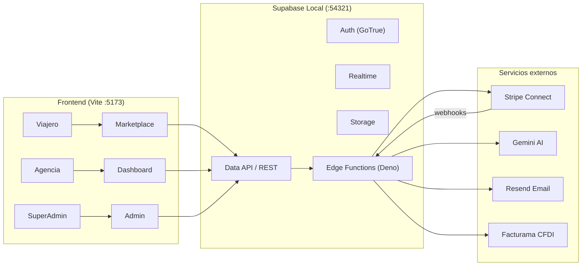

# LPAV Marketplace & Dashboard — Documentación Técnica (Estado Actual)

> Documento de referencia del estado actual del proyecto **LPAV Marketplace** (plataforma de agencias de viaje).
> Generado: 2026-08-20.

---

## 1. Resumen ejecutivo

**LPAV Marketplace** es una plataforma que conecta directamente a **viajeros** con **agencias de viaje**. Las agencias publican paquetes turísticos ("flyers"), los viajeros los exploran, compran (anticipo o pago diferido), y chatean con la agencia. Las agencias gestionan su operación (CRM de leads, finanzas, logística, roles de equipo) desde un dashboard propio. Un **SuperAdmin** supervisa toda la plataforma.

> **Nota (septiembre 2026):** El sistema de puntos de lealtad (Avimo Puntos) está temporalmente desactivado. No se generan ni descuentan puntos. Las tablas y datos históricos se conservan para futura reactivación.

El cobro se hace con **Stripe Connect (destination charges)**: el viajero paga a la plataforma, la plataforma retiene su comisión (`application_fee_amount`) y el remanente se transfiere automáticamente a la cuenta conectada de la agencia (`transfer_data.destination`).

**Estado:** entorno local 100 % funcional, casi listo para producción. La migración del SDK de Stripe a `stripe@22` (sin `apiVersion` deprecado) está **completada** en las 5 Edge Functions que faltaban.

---

## 2. Stack tecnológico

| Capa | Tecnología |
|------|------------|
| Frontend | React 19, TypeScript 5.8, Vite 6, Tailwind CSS 4, react-router 7 |
| UI | `lucide-react` (iconos), componentes propios en `src/components/ui` |
| Estado | React Context (`AuthContext`, `CartContext`, `ThemeContext`, `ToastProvider`) |
| i18n | `i18next` + `react-i18next` (es-MX y en) |
| PWA | `vite-plugin-pwa` |
| Backend | Supabase Edge Functions (Deno runtime, `supabase-edge-runtime-1.74.1` / Deno v2.1.4) |
| Base de datos | PostgreSQL 17 (Supabase), 43 tablas + RPCs + RLS |
| Pagos | Stripe Connect (SDK `stripe@22`, API V2 para cuentas) |
| Email | Resend (`send-email`) |
| IA | Google Gemini (`generate-itinerary`, `ai-qualify-lead`) |
| Fiscal | Facturama (CFDI) — pendiente de activar |
| CRM externo | Twenty CRM (SSO) — pendiente de activar |
| Testing | Vitest + Testing Library + jsdom |
| Gestor de paquetes | pnpm 11 (workspace) |

---

## 3. Arquitectura general



- **Frontend** usa `@supabase/supabase-js` con la *anon key* (`VITE_SUPABASE_ANON_KEY`) para todo el acceso a datos (respaldado por **RLS**).
- **Edge Functions** son los únicos puntos que conocen secretos (`STRIPE_SECRET_KEY`, `SERVICE_ROLE_KEY`, etc.) y ejecutan lógica sensible (pagos, webhooks, IA, email, CFDI).
- **Multi-tenancy**: cada agencia es un *tenant* (`agencies_tenants.tenant_id`); el aislamiento se garantiza con RLS.

---

## 4. Estructura del repositorio

```
.
├── src/                        # Frontend React
│   ├── components/             # admin/, agency/, auth/, crm/, layout/, marketplace/,
│   │                           #   notifications/, ui/
│   ├── context/                # AuthContext, CartContext, ThemeContext
│   ├── hooks/                  # useDebounce, useSupabase
│   ├── lib/                    # constants, errors, formatters, i18n, supabaseClient, validation
│   ├── locales/                # en/, es-MX/
│   ├── pages/                  # rutas de la app
│   ├── types/                  # database.ts (tipos Supabase), api.ts, index.ts
│   └── __tests__/              # tests de integración y seguridad
├── supabase/
│   ├── config.toml             # config local (puertos, seed, realtime)
│   ├── migrations/             # 34 migraciones SQL ordenadas por timestamp
│   ├── functions/              # 35 Edge Functions
│   │   ├── _shared/            # código compartido (auth, cors, http, stripe, repo, validation)
│   │   └── <nombre>/index.ts   # cada función
│   └── seed.sql                # seed vacío (los datos se cargan vía scripts/seed.ts)
├── scripts/
│   ├── seed.ts                 # carga datos de prueba (usuarios, agencias, paquetes, leads…)
│   └── simulate-connected-account.ts  # crea cuenta Express V2 + account link
├── dist/                       # build de producción
├── coverage/                   # reportes de cobertura de tests
├── .env / .env.example         # variables de entorno
└── handoff.md                  # protocolo de handoff entre agentes
```

---

## 5. Roles y multi-tenancy

### Roles de sistema (`profiles.role_name`)

| Rol | Descripción |
|-----|-------------|
| `EndUser` | Viajero (consumidor del marketplace). |
| `SuperAdmin` | Administrador global de la plataforma (ruta `/admin`, solo localhost). |
| `Agency_Admin` | Dueño/administrador de una agencia (un `tenant_id`). |
| `Agency_Collaborator` | Colaborador estándar de agencia. |
| `Agency_Agent` | Agente de ventas de agencia. |
| `Agency_Pending` | Usuario que inició registro como agencia (aún sin tenant). |

> Además, las agencias pueden crear **roles personalizados** (`custom_roles_permissions`) vía `create-role`, con permisos granulares (`can_manage_catalog`, `can_view_global_leads`, `can_manage_finance`, `can_manage_chat`).

### Lógica de rol en el frontend (`src/context/AuthContext.tsx`)

- `isAgency`: `Agency_Admin` o (tiene `tenant_id` y no es `EndUser`/`SuperAdmin`/`Agency_Pending`).
- `isSuperAdmin`: `role_name === "SuperAdmin"`.
- `isTraveler`: usuario autenticado que no es agencia ni admin ni pendiente.

### Aislamiento

- Cada agencia opera bajo su `tenant_id`; todas las tablas de negocio tienen `tenant_id` y políticas **RLS** que filtran por el tenant del usuario autenticado.
- Existen migraciones específicas de RLS (`20260622000003_rls_policies`, `20260714000000_fix_travel_packages_rls`, `20260808000000_agency_fiscal_rls`, etc.) y un arreglo de recursión (`20260715000001_fix_rls_recursion`).

---

## 6. Base de datos (43 tablas)

### Identidad y tenancy
`profiles`, `agencies_tenants`, `agency_team_members`, `agency_invitations`, `custom_roles_permissions`

### Catálogo / Marketplace
`travel_packages`, `package_reviews`, `package_reports`, `package_inventory_link`, `user_saved_packages`, `user_recommendation_profiles`, `user_behavior_logs`, `cached_itineraries`

### Chat
`chat_messages`, `conversation_participants`

### CRM
`crm_leads`, `crm_activities`, `crm_agent_assignment_queue`, `crm_ai_qualification_sessions`

### Pagos y finanzas
`transactions_orders`, `installment_schedules`, `payment_reminders`, `fiscal_income_records`, `fiscal_expense_records`, `fiscal_periods`, `saas_subscriptions`

### Stripe Connect
`stripe_accounts`, `connect_accounts`, `seller_stripe_accounts`, `connect_orders`

> Nota: conviven **tres** representaciones de cuentas Stripe según el flujo (ver §10):
> - `stripe_accounts` → flujo de producción del marketplace (agencia).
> - `seller_stripe_accounts` → flujo refactorizado `onboard-seller` (repositorio `seller-accounts.repo.ts`).
> - `connect_accounts` → demo `/connect-demo`.

### Cartera y puntos (TEMPORALMENTE INACTIVO — Sección 6.4 DOC MAESTRO)
`user_wallets`, `wallet_transactions` — Las tablas y datos históricos se conservan para futura reactivación. No reciben escrituras ni lecturas activas desde la aplicación.

### Logística / Operaciones
`rooming_lists`, `travel_incidents`, `traveler_documents`, `inventory_pools`, `inventory_holds`, `inventory_audit_log`, `external_sales_log`

### Notificaciones
`notifications`, `notification_delivery_log`, `notification_preferences`

### Migraciones destacadas

| Migración | Contenido |
|-----------|-----------|
| `20260622000000_init_auth_and_tenants` | perfiles, tenants, trigger de perfil en signup |
| `20260622000001_operations_and_ai` | operaciones, itinerarios IA |
| `20260622000002_chat_and_realtime` | chat, conversaciones |
| `20260622000003/07/08` + `15000001` + `14000000` | políticas RLS y arreglos |
| `20260715000000_auth_refactor` | invitaciones, equipo, roles de agencia |
| `20260716000000_stripe_and_financial` | Stripe inicial + finanzas |
| `20260722000000_points_and_commission_upgrade` | puntos y comisiones |
| `20260723000000_fee_split_and_fiscal` | desglose de fees y fiscal |
| `20260729000000_four_tier_plans` | 4 planes (Básico/Intermedio/Premium/Fundador) |
| `20260804000000-03_inventory_*` | inventario por habitaciones (4 fases) |
| `20260805000001_user_saved_packages` | guardar paquetes favoritos |
| `20260807000000_fundador_approval_workflow` | aprobación del plan Fundador |
| `20260808000001_chat_payment_and_filters` | pago desde chat + filtros |
| `20260813000000_connect_v2_sample` | muestra Connect V2 |
| `20260814000000_marketplace_stripe_connect` | Stripe Connect del marketplace |
| `20260815000000_grant_api_privileges` | GRANTs del Data API |
| `20260819000000_orders_package_id` | columna `package_id` en órdenes |

---

## 7. Autenticación y flujos de usuario

- **Proveedores**: Google OAuth y email/password (Supabase Auth).
- **Intención de registro**: al registrarse con `intent === "agency_register"`, el usuario queda con rol `Agency_Pending` y luego completa el alta (`AgencyPostRegister`).
- **Invitaciones**: los `Agency_Admin` invitan colaboradores vía `agency_invitations`; el invitado acepta en `/auth/accept-invite`.
- **Guardas de ruta** (`AuthGuard`): `requireAgency`, `requireTraveler`, `requireSuperAdmin`; `LocalhostGuard` restringe `/admin` a localhost.

---

## 8. Frontend — rutas y páginas

| Ruta | Página | Rol |
|------|--------|-----|
| `/` | `Home` (catálogo marketplace) | público |
| `/package/:id` | `PackageDetailPage` | público |
| `/auth/login` | `LoginPage` | público |
| `/auth/agency` | `AgencyAuth` (registro/login agencia) | público |
| `/agency/post-register` | `AgencyPostRegister` | agencia |
| `/auth/accept-invite` | `AcceptInvitation` | invitado |
| `/checkout` | `Checkout` | viajero |
| `/orders` | `Orders` | viajero |
| `/chat` | `Chat` | autenticado |
| `/connect-demo` | `ConnectDemo` | demo Stripe Connect |
| `/agency/dashboard` | `AgencyDashboard` | agencia |
| `/agency/flyers` | `AgencyFlyers` | agencia |
| `/agency/roles` | `AgencyRoles` | agencia |
| `/agency/crm` | `AgencyCRM` | agencia |
| `/agency/finance` | `AgencyFinance` | agencia |
| `/agency/logistics` | `AgencyLogistics` | agencia |
| `/agency/settings` | `AgencySettings` | agencia |
| `/agency/analytics` | `AgencyAnalytics` | agencia |
| `/agency/chat` | `Chat` | agencia |
| `/admin` | `SuperAdminDashboard` | superadmin (solo localhost) |

### Componentes destacados

- **Marketplace**: `CatalogGrid`, `FlyerCard`, `Hero`, filtros (`DepartureCityFilter`, `PriceFilter`, `RegionFilter`), `ReviewForm`, `ReviewList`, `OnboardingModal`.
- **Agencia**: `AgencyLayout`/`AgencySidebar`, finanzas (`AgencyFiscalIncome`, `AgencyPnlStatement`, `AgencyExpenseTracking`), `ExternalSalesPanel`, `PlanManagement`, `StripeConnectStatus`, `TeamManagement`, `DocumentVault`, `IncidentCenter`, `CfdiInvoices`.
- **UI base**: `Button`, `Modal`, `Table`, `Tabs`, `Toast`, `Stepper`, etc.

---

## 9. Edge Functions (35)

### Código compartido (`_shared/`)

| Archivo | Responsabilidad |
|---------|-----------------|
| `auth.ts` | `getUser` (valida JWT), `createServiceClient` (service role) |
| `cors.ts` | cabeceras CORS |
| `http.ts` | helpers de respuesta JSON + `handle` (envuelve controladores y centraliza errores) |
| `rateLimit.ts` | rate limiting |
| `validation.ts` | parseo y saneamiento de inputs |
| `stripe/client.ts` | **fábrica única** `getStripeClient()` (stripe@22) + `getWebhookSecret()`; lanza `StripeConfigurationError` |
| `stripe/errors.ts` | jerarquía de errores (`StripeServiceError`, etc.) + `mapStripeError` |
| `stripe/accounts.service.ts` | servicio de cuentas Express (onboarding) |
| `stripe/payments.service.ts` | servicio de pagos destination charge |
| `stripe/webhook.service.ts` | servicio de webhooks (verificación + enrutado) |
| `stripe.ts` | **fábrica legacy** (`getStripeClient`) usada por las funciones `connect-*` |
| `repository/seller-accounts.repo.ts` | repo de cuentas de vendedor (`seller_stripe_accounts`) |
| `repository/orders.repo.ts` | repo de órdenes |

> Existen **dos** fábricas de cliente Stripe: `_shared/stripe.ts` (legacy, usado por `connect-*`) y `_shared/stripe/client.ts` (canónico, usado por el flujo de producción y por el resto de funciones). Ambas instancian `stripe@22` sin `apiVersion`.

### Catálogo de funciones

**Flujo de producción del marketplace (destination charges):**

| Función | Descripción |
|---------|-------------|
| `create-connect-account` | Crea cuenta Express **V2** (`v2.core.accounts` recipient) + account link para la agencia |
| `create-checkout` | Checkout hosted de un paquete (destination charge) |
| `create-chat-payment` | Solicitud de pago desde el chat (destination charge) |
| `create-payment-intent` | PaymentIntent destination charge (implementación DI con servicios/repos) |
| `stripe-webhook` | Webhook principal (checkout, chat, disputas, suscripciones) |
| `stripe-marketplace-webhook` | Webhook del marketplace (destination charges, DI) |
| `get-agency-transfers` | Lista transferencias recibidas por la agencia |
| `manage-subscription` | Suscripción SaaS (cambio de plan / portal de facturación) |
| `installment-reminder` | Recordatorios de abonos (cargo **directo** a la cuenta conectada) |

**Demo / muestra Stripe Connect (`/connect-demo`):**

| Función | Descripción |
|---------|-------------|
| `connect-account` | Crea cuenta conectada V2 → `connect_accounts` |
| `connect-onboard` | Genera account link V2 |
| `connect-checkout` | Checkout destination charge (producto → cuenta) |
| `connect-products` | CRUD de productos a nivel plataforma |
| `connect-status` | Estado de onboarding consultando Stripe |
| `connect-webhook` | Webhook V1 + thin events V2 |

**Onboarding de vendedor refactorizado (DI, `seller_stripe_accounts`):**

| Función | Descripción |
|---------|-------------|
| `onboard-seller` | Crea cuenta Express + account link |
| `seller-onboarding-status` | Estado de onboarding del vendedor |
| `seller-login-link` | Login link al dashboard Express |

**CRM (leads):**

| Función | Descripción |
|---------|-------------|
| `create-lead` | Crea un lead |
| `ai-qualify-lead` | Pre-calificación de lead con IA |
| `assign-lead` | Asigna lead a un agente |
| `add-lead-activity` | Registra actividad en un lead |
| `update-lead-status` | Cambia el estado del lead |
| `transfer-lead-to-human` | Transfiere lead de bot a humano |
| `chat-offline-check` | Detecta agente offline en chat |

**Otros:**

| Función | Descripción |
|---------|-------------|
| `generate-itinerary` | Genera itinerario con Gemini (con caché) |
| `generate-cfdi` | Genera CFDI vía Facturama |
| `send-email` | Envía email vía Resend |
| `dispatch-notification` | Despacha notificaciones |
| `presigned-url` | URL firmada para subir archivos a Storage |
| `report-package` | Reportar un paquete |
| `review-package` | Reseñar un paquete |
| `create-role` | Crear rol personalizado de agencia |
| `sync-inventory` | Sincroniza inventario de habitaciones |
| `crm-exchange-token` | Token SSO de Twenty CRM |

---

## 10. Integración Stripe Connect (detalle)

### 10.1 Modelo de cobro: destination charges

- El **viajero paga a la plataforma** (la sesión/PaymentIntent se crea en la cuenta de la plataforma, `STRIPE_SECRET_KEY`).
- La plataforma retiene la comisión con `payment_intent_data.application_fee_amount`.
- El remanente se transfiere automáticamente a la cuenta conectada de la agencia con `payment_intent_data.transfer_data.destination`.

```text
Viajero ──pago──▶ Plataforma (Stripe) ──transfer (total - fee)──▶ Cuenta agencia
                        │
                        └─ application_fee_amount (comisión marketplace)
```

- Para **cobrar** (destination charge) la cuenta conectada solo necesita la capability **`stripe_transfers`** (configuración `recipient` en API V2). La cuenta bancaria solo es necesaria para **retiros**.

### 10.2 Cuentas conectadas (API V2)

Las cuentas Express se crean con la **API V2** (`stripe.v2.core.accounts.create`), porque Stripe deshabilitó la creación V1 (`stripe.accounts.create` con `type: 'express'`):

```ts
stripe.v2.core.accounts.create({
  display_name, contact_email,
  identity: { country: "mx" },
  dashboard: "express",
  defaults: {
    responsibilities: {
      fees_collector: "application",   // la plataforma recauda comisiones
      losses_collector: "application", // la plataforma asume pérdidas
    },
  },
  configuration: {
    recipient: {
      capabilities: {
        stripe_balance: {
          stripe_transfers: { requested: true },
        },
      },
    },
  },
});
```

El **account link** de onboarding también usa V2 (`stripe.v2.core.accountLinks.create` con `use_case: account_onboarding` y `configurations: ["recipient"]`).

> **Regla importante**: el TOS de cuentas Express **solo** se acepta en el flujo alojado de Stripe (no programáticamente). Stripe lo rechaza con `tos_acceptance_on_behalf_not_allowed`. En modo test se usa "Rellenar con datos de prueba".

### 10.3 Las tres implementaciones coexistentes

| Flujo | Funciones | Cliente | Tabla | Notas |
|-------|-----------|---------|-------|-------|
| **Producción marketplace** | `create-connect-account`, `create-checkout`, `create-chat-payment`, `stripe-webhook`, `stripe-marketplace-webhook`, `create-payment-intent` | `_shared/stripe/client.ts` | `stripe_accounts` | Destino de la migración actual |
| **Demo** | `connect-*` | `_shared/stripe.ts` (legacy) | `connect_accounts` | Página `/connect-demo` |
| **Onboarding refactorizado** | `onboard-seller`, `seller-*` | `_shared/stripe/client.ts` + `accounts.service.ts` | `seller_stripe_accounts` | Usa `accounts.service.ts` (aún V1 `accounts.create` con `card_payments`+`transfers`) |

> **Deuda técnica / pendiente de unificar**: `_shared/stripe/accounts.service.ts` todavía usa la API V1 de cuentas (`stripe.accounts.create({ type: 'express', capabilities: { card_payments, transfers } })`), hoy deprecada por Stripe. El flujo de producción ya migró a V2; el refactorizado (`onboard-seller`) no.

### 10.4 Webhooks

- `stripe-webhook`: procesa `checkout.session.completed` (crea órdenes, consume holds, registra fiscales, envía recibo), `charge.dispute.created`, `customer.subscription.updated/deleted`, `invoice.payment_failed`. Nota: no acredita ni debita puntos mientras el programa esté inactivo.
- `stripe-marketplace-webhook`: procesa `payment_intent.succeeded/failed`, `account.updated`, `charge.refunded`, `charge.dispute.created` (vía `StripeWebhookService`).
- `connect-webhook`: demo que soporta eventos V1 y **thin events V2**.
- Ambos endpoints verifican la firma con `STRIPE_WEBHOOK_SECRET` (`constructEvent` sobre el payload raw).

### 10.5 Tipos de cobro

| Escenario | Modo | Función |
|-----------|------|---------|
| Compra de paquete (anticipo 20 %) | destination charge | `create-checkout` |
| Solicitud de pago en chat | destination charge | `create-chat-payment` |
| Abonos / recordatorios | **cargo directo** (`{ stripeAccount }`) | `installment-reminder` |
| PaymentIntent genérico | destination charge | `create-payment-intent` |

> **Decisión pendiente (negocio)**: `installment-reminder` aún usa cargo directo (`{ stripeAccount }`), lo que requiere `card_payments` en la cuenta conectada, mientras el resto usa destination charge (`stripe_transfers`). Se decidió mantenerlo como cargo directo por ahora.

---

## 11. Modelo de negocio

### Planes (4 niveles)

| Plan | Precio | Comisión | Notas |
|------|--------|----------|-------|
| Básico | $0/mes | 20 % | 50 flyers, 1 admin |
| Intermedio | $1,799/mes | 18 % (pref. 17 %) | 1 rol personalizado, 3–5 colaboradores |
| Premium | $2,999/mes | 15 % (pref. 12 %) | 3 roles, colaboradores ilimitados |
| Fundador | $0/mes | 7.5 % | solo asignable por SuperAdmin (10 plazas) |

- Tasas preferenciales por conversión (`PLAN_PREFERENTIAL_THRESHOLDS`): Intermedio ≥5 % → 17 %, Premium ≥8 % → 12 %.
- Cambio de plan a Intermedio/Premium vía `manage-subscription` (Stripe Checkout de suscripción). Básico es inmediato; Fundador requiere aprobación de SuperAdmin.

### Comisiones y fiscales

- Comisión de la agencia = `precio × commission_rate`.
- IVA del 16 % (`IVA_RATE`); se desglosa subtotal/IVA en `fiscal_income_records`.
- Fee de Stripe estimado: `4.1 % + $3 MXN` (`STRIPE_FEE_RATE`/`STRIPE_FEE_FIXED`).

### Puntos de lealtad (TEMPORALMENTE INACTIVO)

> **Estado actual:** El sistema de puntos está desactivado. No se generan ni descuentan puntos en ninguna transacción. Las constantes (`POINTS_PER_100_MXN`, `POINT_VALUE_MXN`, etc.) fueron retiradas de `constants.ts`. Las tablas `user_wallets` y `wallet_transactions` permanecen en la BD con datos históricos para futura reactivación. Ver Sección 6.4 del DOC MAESTRO para el plan de reactivación.

### Pagos diferidos (abonos)

- Anticipo mínimo 20 % (`MIN_DEPOSIT_PERCENTAGE`).
- Plazo máximo de 4 meses (`MAX_DEFERRED_MONTHS`).
- Seguimiento en `installment_schedules` + `payment_reminders` (`installment-reminder`).

---

## 12. Entorno de desarrollo local

### Requisitos
- Docker, Supabase CLI, Node.js + pnpm, Stripe CLI (para webhooks).

### Arranque

```bash
# 1. Base de datos + servicios locales
supabase start

# 2. Frontend
pnpm dev            # http://localhost:5173

# 3. (Opcional) reenviar webhooks de Stripe
stripe listen --forward-to localhost:54321/functions/v1/stripe-webhook

# 4. Cargar datos de prueba
node scripts/seed.ts
```

### URLs locales

| Servicio | URL |
|----------|-----|
| Frontend (Vite) | http://localhost:5173 |
| Supabase API | http://127.0.0.1:54321 |
| Studio | http://127.0.0.1:54323 |
| Inbucket (emails) | http://127.0.0.1:54324 |
| DB (directo) | 127.0.0.1:54322 |

### Contenedor edge runtime

```bash
docker restart supabase_edge_runtime_LPAV-Marketplace-Dashboard
docker logs --tail 100 supabase_edge_runtime_LPAV-Marketplace-Dashboard
```

### Datos de prueba (`scripts/seed.ts`)

- **Password** de todos: `Test1234!`
- **SuperAdmin**: `admin@lpav.com`
- **Agencias**: `agencia1@viajes.com` (Intermedio), `agencia2@tours.com` (Premium); colaboradores `ventas1@viajes.com`, `ventas2@viajes.com`
- **Viajeros**: `viajero1@test.com`, `viajero2@test.com`, `viajero3@test.com`
- 4 agencias, 8 paquetes, 12 leads CRM, 6 órdenes, 2 reportes, notificaciones, 1 rol personalizado.
- `SEED_SKIP_STRIPE=1` omite la creación de cuentas Stripe falsas (para hacer onboarding real).

### Simulación de cuenta conectada

```bash
node scripts/simulate-connected-account.ts agencia1@viajes.com
```

Crea la cuenta Express V2 de la agencia, la guarda en `agencies_tenants` + `stripe_accounts`, y genera el account link de onboarding (expira en ~5 min). En modo test se pulsa "Rellenar con datos de prueba".

---

## 13. Pruebas

```bash
pnpm test              # Vitest (run)
pnpm test:ui           # UI
pnpm test:coverage     # cobertura
pnpm typecheck         # tsc --noEmit
```

- Tests de **integración**: `auth-flow`, `cart-flow`.
- Tests de **seguridad**: `api-key-leak`, `auth-bypass`, `cors-routing`, `input-validation`, `multi-tenant-isolation`, `rate-limit`, `secret-detection`, `service-role-exposure`.
- Tests unitarios de componentes CRM, contextos, hooks y libs.

---

## 14. Variables de entorno

Definidas en `.env.example` (nunca subir `.env` real):

| Variable | Uso |
|----------|-----|
| `SUPABASE_URL` / `SUPABASE_ANON_KEY` / `SUPABASE_SERVICE_ROLE_KEY` | Supabase |
| `VITE_SUPABASE_URL` / `VITE_SUPABASE_ANON_KEY` | Supabase en el frontend |
| `GOOGLE_CLIENT_ID` / `GOOGLE_CLIENT_SECRET` | Google OAuth |
| `GEMINI_API_KEY` | IA |
| `STRIPE_SECRET_KEY` / `STRIPE_WEBHOOK_SECRET` / `STRIPE_CONNECT_CLIENT_ID` | Stripe |
| `RESEND_API_KEY` | Email |
| `TWENTY_CRM_*` | CRM externo (pendiente) |
| `FACTURAMA_*` | CFDI (pendiente) |
| `VITE_APP_URL` | URL base del frontend |

---

## 15. Estado actual, issues conocidos y pendientes

### Completado
- Entorno local 100 % funcional (Supabase, Vite, Stripe CLI).
- Correcciones: migración duplicada, GRANTs del Data API, CSP local, `.maybeSingle()`, UI de notificaciones.
- `create-connect-account` (V1→V2), `transactions_orders` (columna `package_id` + FK + seed + webhook).
- `create-checkout` con destination charge correcto (usa `getStripeClient()` de `_shared/stripe/client.ts`).
- **Migración SDK Stripe@17→@22 completada** en las 5 funciones restantes (`create-chat-payment`, `stripe-webhook`, `get-agency-transfers`, `manage-subscription`, `installment-reminder`), eliminando `apiVersion: "2025-04-30.basil"`.

### Pendientes / bloqueadores
- La cuenta conectada de `agencia1` (`acct_1U60qu0FcayoHdbn`) **aún no completa onboarding** (`stripe_transfers` en `restricted`): abrir el account link y aceptar TOS con "datos de prueba".
- **`installment-reminder`**: sigue como cargo directo (requiere `card_payments`). Decisión de negocio pendiente de consolidar.
- **`_shared/stripe/accounts.service.ts`**: aún usa API V1 de cuentas (deprecada); el flujo `onboard-seller`/`seller-*` no está migrado a V2.
- Conviven tres representaciones de cuentas Stripe (`stripe_accounts`, `seller_stripe_accounts`, `connect_accounts`) — candidatas a unificar.
- Veinte CRM y Facturama (CFDI) aún no activados.

### Guardrails (NO hacer)
- ❌ NO ejecutar `supabase stop --no-backup` (borra la data local).
- ❌ NO desplegar migraciones ni secretos al proyecto remoto `qmcpaqbxbmkhxjezhlch` (es compartido/producción).
- ❌ NO aceptar TOS de cuentas Express programáticamente.
- ❌ NO reintroducir `{ stripeAccount }` junto a `transfer_data.destination` en `create-checkout`.
